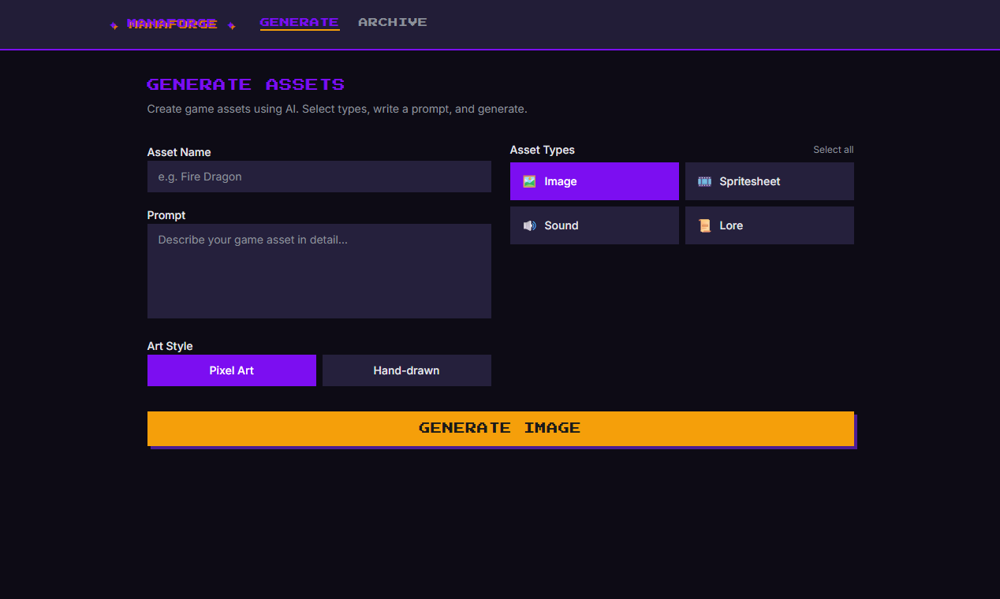
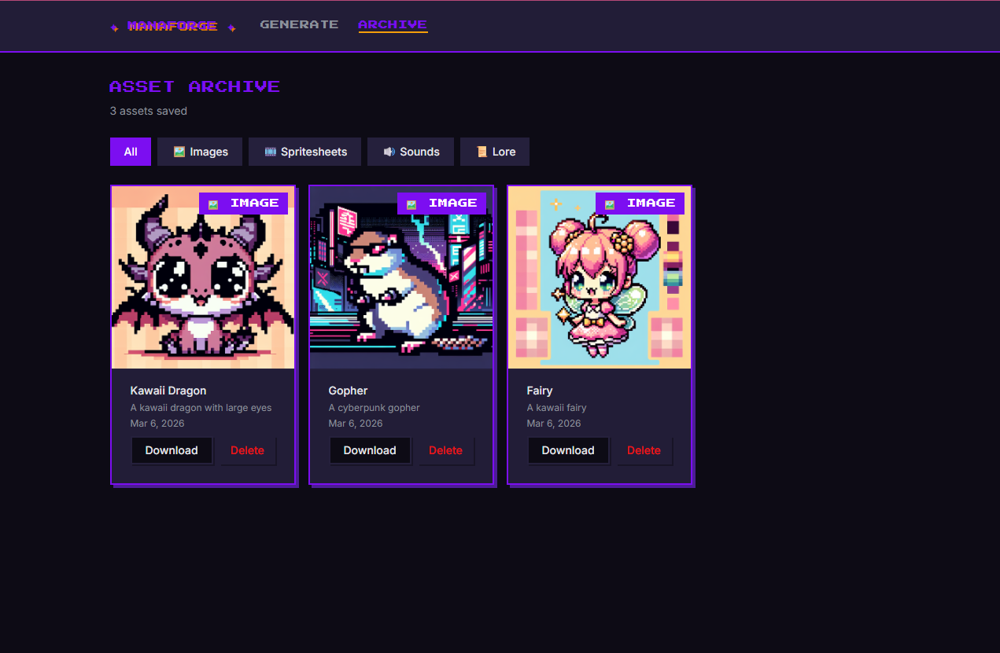

# ManaForge

A self-hosted game asset generation dashboard. Generate images, spritesheets, sounds, and lore from a single prompt using AI APIs, with a persistent archive to browse and download everything you've created.

## Demo





## Features

- **Images** — Single illustrations via DALL-E 3 (pixel art or hand-drawn style)
- **Spritesheets** — Animation frames generated individually and stitched into a PNG grid
- **Sounds** — Sound effects via ElevenLabs
- **Lore** — World-building text via OpenRouter (choose any model from the dropdown)
- **Generate All** — Kick off all four asset types in parallel with one click
- **Archive** — Browse, preview, and download all previously generated assets
- **Real-time progress** — Server-Sent Events with per-asset progress bars during generation
- **Live archive** — PocketBase real-time subscription keeps the archive updated automatically

## Stack

| Layer | Technology |
|-------|-----------|
| Frontend | Vue 3 + Vite + Shadcn-vue + TailwindCSS v4 + Pinia |
| Backend | Python FastAPI + uv |
| Database | PocketBase v0.36.6 |
| Images | OpenAI DALL-E 3 |
| Sounds | ElevenLabs Sound Effects |
| Lore | OpenRouter (model selectable in UI) |

## Prerequisites

- Docker and Docker Compose
- API keys for the services you want to use (see below)

### Installing Docker

**Windows (WSL2) — recommended approach:**

1. Download and install [Docker Desktop for Windows](https://www.docker.com/products/docker-desktop/)
2. Open Docker Desktop → Settings → Resources → WSL Integration
3. Enable integration for your WSL2 distro (e.g. Ubuntu)
4. Click **Apply & Restart**
5. Open a new WSL2 terminal and verify:
   ```bash
   docker --version
   docker compose version
   ```

**Linux (native):**

```bash
# Install Docker Engine
curl -fsSL https://get.docker.com | sh
sudo usermod -aG docker $USER
newgrp docker

# Verify
docker --version
docker compose version
```

**macOS:**

Install [Docker Desktop for Mac](https://www.docker.com/products/docker-desktop/) and launch it before running any `make` commands.

## Setup

### 1. Clone the repo

```bash
git clone https://github.com/your-username/manaforge.git
cd manaforge
```

### 2. Configure environment variables

```bash
cp .env.example .env
```

Edit `.env` and fill in your API keys:

```env
# Required for image and spritesheet generation
OPENAI_API_KEY=sk-...

# Required for sound generation
ELEVENLABS_API_KEY=...

# Required for lore generation
OPENROUTER_API_KEY=sk-or-...

# PocketBase — internal Docker network URL (do not change for Docker)
POCKETBASE_URL=http://pocketbase:8090

# Superuser credentials for PocketBase admin access
POCKETBASE_SUPERUSER_EMAIL=admin@manaforge.local
POCKETBASE_SUPERUSER_PASSWORD=changeme   # change this

# Frontend URLs (used at build time by Vite)
VITE_API_BASE_URL=http://localhost:8000
VITE_POCKETBASE_URL=http://localhost:8090
```

You only need keys for the asset types you plan to use. If a key is missing and you attempt to generate that type, you'll see a clear error message in the UI.

### 3. Start in development mode

```bash
make dev
```

This starts all three services with hot reload:

| Service | URL |
|---------|-----|
| Frontend (Vite) | http://localhost:5174 |
| Backend (FastAPI) | http://localhost:8000 |
| PocketBase | http://localhost:8090 |
| PocketBase Admin UI | http://localhost:8090/_/ |

The first run will build Docker images and download PocketBase — this takes a minute or two.

### 4. Verify everything is running

```bash
# Check all containers are up
docker compose ps

# Tail logs from all services
make logs

# Hit the backend health endpoint
curl http://localhost:8000/health
# → {"status": "ok"}

# Check OpenRouter models are reachable
curl http://localhost:8000/api/models | head -c 200
```

## Usage

1. Open http://localhost:5174
2. Enter a name and prompt for your asset (e.g. `"Fire Dragon"`, `"A fierce fire-breathing dragon with crimson scales"`)
3. Choose an art style (Pixel Art or Hand-drawn)
4. Select which asset types to generate, or click **Select all**
   - Spritesheet: choose how many animation frames (2–12)
   - Sound: choose duration (1–22 seconds)
   - Lore: choose the OpenRouter model from the dropdown
5. Click **Generate** — progress bars appear for each asset type in real time
6. Once done, preview and download assets directly from the generation cards
7. Visit **Archive** to browse all previously generated assets, filter by type, and download

## Make Commands

```bash
make dev        # Start all services with hot reload (development)
make build      # Build all Docker images
make up         # Start containers in the background (production)
make down       # Stop all containers
make logs       # Tail logs from all services
make pb-migrate # Run PocketBase migrations manually
make clean      # Stop containers and remove all volumes and images
make bump       # Bump version (default: patch). Use make bump PART=minor or PART=0.2.0
make lint       # Run linters (ESLint + ruff)
make lint-fix   # Fix linting issues and auto-format code
make test       # Run all tests (frontend + backend)
make test-frontend # Run frontend tests only
make test-backend  # Run backend tests only
```

## Development

### Linting

Code quality is maintained with ESLint (frontend) and ruff (backend). Run checks locally before committing:

```bash
make lint        # Check both frontend and backend
make lint-fix    # Auto-fix and format issues
```

For frontend-only: `cd frontend && pnpm lint`
For backend-only: `cd backend && ruff check app`

### Formatting

Code is automatically formatted as part of `make lint-fix`:

- **Frontend**: Prettier (via `pnpm lint:fix`)
- **Backend**: ruff format (via `make lint-fix`)

### Type Checking

The frontend uses TypeScript. Type check without building:

```bash
cd frontend && pnpm typecheck
```

This runs during the build step as well.

### Testing

Run tests locally:

```bash
make test              # Run all tests
make test-frontend     # Frontend tests only (vitest)
make test-backend      # Backend tests only (pytest)
```

**Frontend**: Unit tests for utilities and stores using [vitest](https://vitest.dev/)
**Backend**: Integration tests using [pytest](https://pytest.org/) with FastAPI's `TestClient`

### Pre-commit Hooks

Optionally install local pre-commit hooks to auto-lint before each commit:

```bash
pip install pre-commit
pre-commit install
```

This will run ruff (lint + format) and ESLint on staged files.

### CI/CD

Every push to `master` and every pull request triggers a GitHub Actions workflow (`.github/workflows/ci.yml`) that:

1. Lints frontend and backend code
2. Type-checks frontend TypeScript
3. Runs all tests
4. Checks for dependency vulnerabilities

## PocketBase Admin

The PocketBase admin UI is available at http://localhost:8090/_/ during development. Log in with the superuser credentials from your `.env` file. From there you can inspect the `assets` collection, browse records, and manage files.

## API Reference

The FastAPI backend exposes:

| Endpoint | Description |
|----------|-------------|
| `POST /api/generate/{type}` | Start generation for a single type (`image`, `spritesheet`, `sound`, `lore`) |
| `POST /api/generate/all` | Start generation for all four types in parallel |
| `GET /api/jobs/{job_id}/stream` | SSE stream for a job's progress |
| `GET /api/models` | List available OpenRouter models |
| `GET /health` | Health check |

Interactive API docs are available at http://localhost:8000/docs while the backend is running.

## Notes on Cost

| Asset type | Provider | Approximate cost |
|-----------|----------|-----------------|
| Image | OpenAI DALL-E 3 | ~$0.04/image (standard quality) |
| Spritesheet (4 frames) | OpenAI DALL-E 3 | ~$0.16 (4 × $0.04) |
| Sound | ElevenLabs | ~$0.008/credit |
| Lore | OpenRouter (e.g. GPT-4o-mini) | ~$0.0002/request |

Spritesheet generation is the most expensive operation since each frame is a separate DALL-E 3 call. DALL-E 3 also has a rate limit of 5 images/minute on the default tier — generating a 6+ frame spritesheet will take at least a minute.

## License

[MIT](LICENSE)
